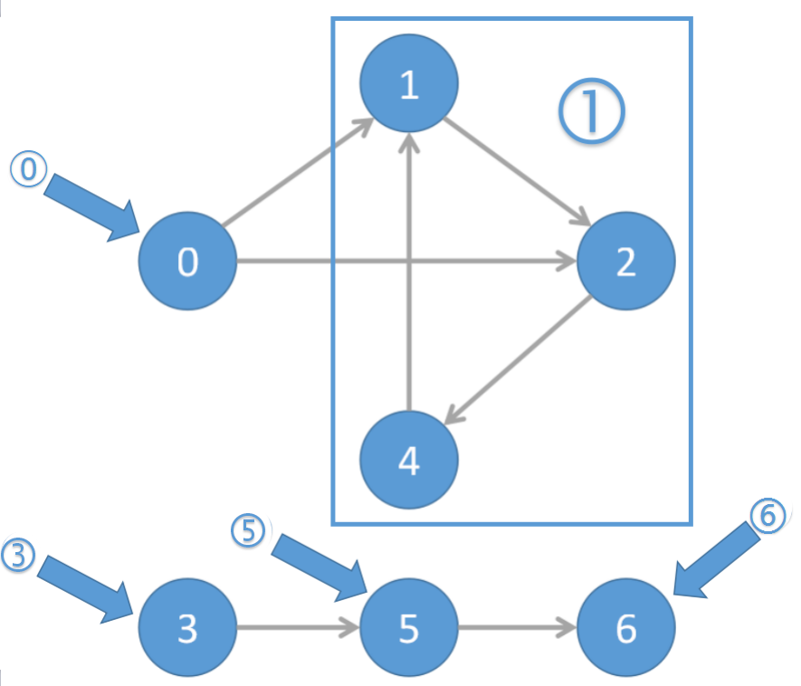
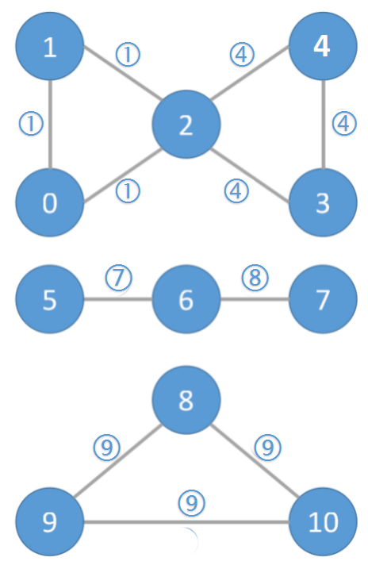

# What is this repository?

This repository is used for storing the code of examples (you can see it in my [proposal](https://docs.google.com/document/d/1UAbERsM32ZaAaz1gjGeMVgi_PDB-bl5rFYtooU0V5WI/edit?usp=sharing])).  

# How to run these code on my computer?

Make sure you have **gcc/g++ 4.6.4** and **Boost 1.46.0** installed.  
Download the code and compile it (I use **ConnectedComponents** as an example, the other two are similiar).  
```
g++ ConnectedComponents.cpp -o ConnectedComponents -Wall
```
Then, run it.  
```
./ConnectedComponents
```

# Read more

[Connected Components](http://www.boost.org/doc/libs/1_46_0/libs/graph/doc/connected_components.html)  
[Strongly Connected Components](http://www.boost.org/doc/libs/1_46_0/libs/graph/doc/strong_components.html)  
[Biconnected Components](http://www.boost.org/doc/libs/1_46_0/libs/graph/doc/biconnected_components.html)  

# Figures of examples
**Connected components**:  
  
**Strongly connected components**:  
  
**Biconnected components**:  
  

# Figures of pgRouting Sample Data
**Connected components**:  
  
**Strongly connected components**:  
  
**Biconnected components**:  
  
